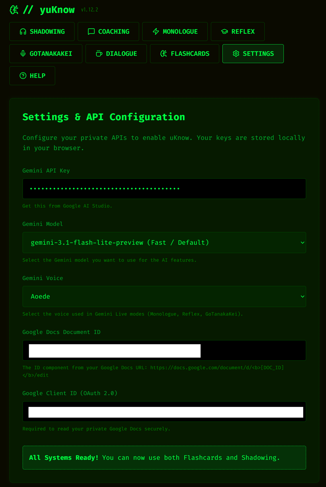
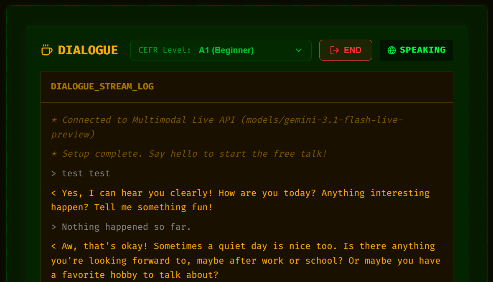
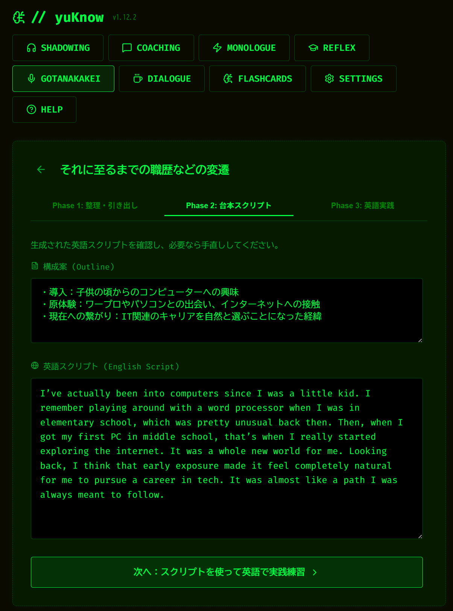
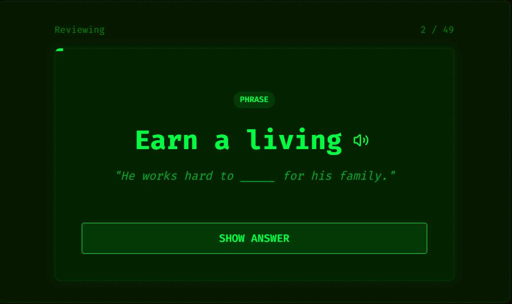
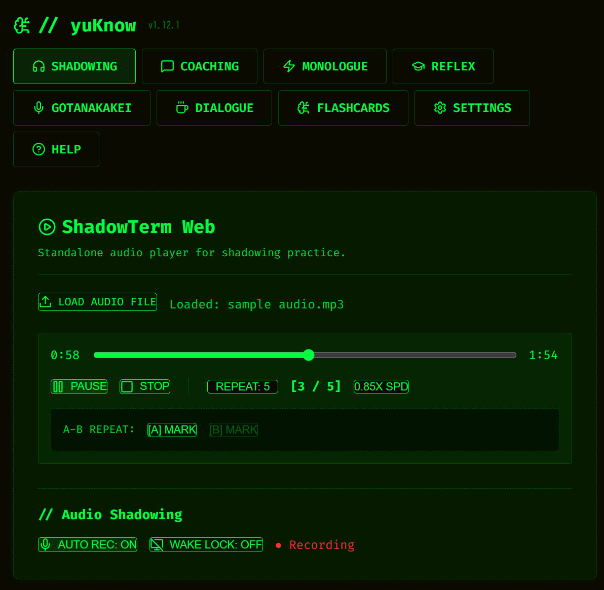
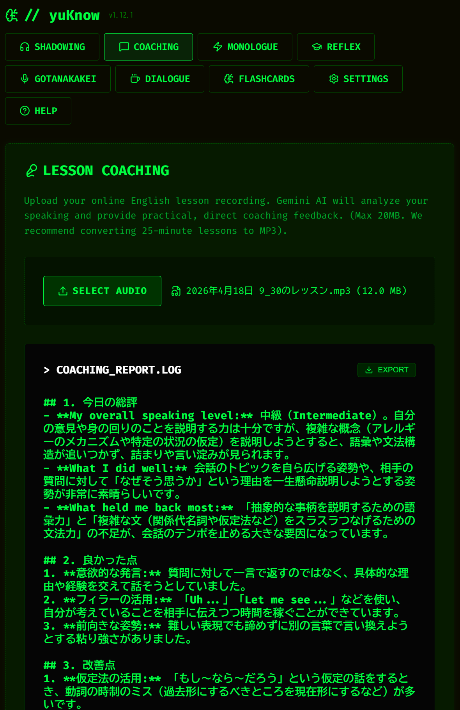
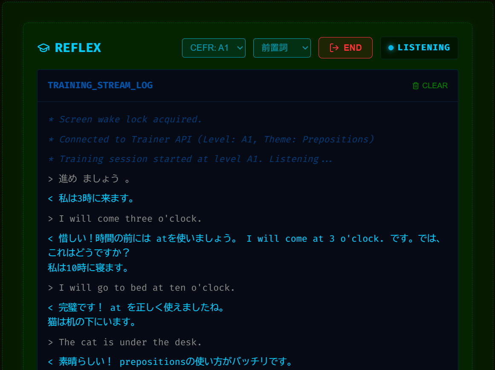
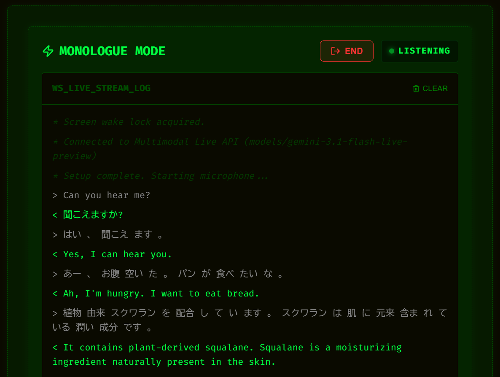

# yuKnow 🕶️🟢

🚀 **Learn English with AI:** [https://yuunaka1.github.io/yuknow/](https://yuunaka1.github.io/yuknow/)

yuKnow は、 **「自分の学習データを自分の管理下に置き、AIを自分の専任コーチにする」** ことをコンセプトにした、完全クライアントサイド動作の次世代語学学習プラットフォームです。
高価なサブスクリプションやサーバーコストは一切不要。 Gemini API キーひとつで、最高の AI 英会話環境が手に入ります。

---

## ⚡ Core Learning Modes

### 1. Dialogue (AI Free Talk) — *New!*
Gemini Multimodal Live API による、超低遅延なリアルタイム・フリートーク練習です。
- **レベル別調整**: CEFRレベル（A1〜C2）を指定することで、AIがあなたのレベルに最適な語彙とスピードで話しかけます。
- **AI総括フィードバック**: 会話終了後に「良かった点」「改善すべき表現」「より自然な言い換え」をまとめた詳細なレポートを自動生成します。

### 2. Describe (Photo Description) — *New!*
TOEIC Speaking テストライクな、写真描写トレーニングモードです。
- **マルチモーダル評価**: 写真（視覚情報）とあなたのスピーキング音声（聴覚情報）を同時に解析し、精緻な評価を行います。
- **実戦シミュレーション**: 45秒の準備時間と45秒の解答時間という本番形式のプレッシャーの中で練習できます。

### 3. GoTanakaKei (Mock Interview)
特定のトピックについての「スクリプト作成」から「模擬インタビュー」までを一貫してサポートします。
- **AI 構成案・スクリプト生成**: 日本語のメモを入力するだけで、AIが論理的な構成案と自然なスピーキング用スクリプトを作成。
- **Live 音声面接**: 学習したスクリプトを元に、AI面接官と対話のシミュレーション。

### 3. Flashcards (Spaced Repetition)
Google Docs に書き留めた学習ノートから、AIが自動で単語帳を作成します。
- **Anki/iKnow スタイル形式**: 忘却曲線に基づいた適切なタイミングでクイズを出題。
- **自動同期**: ドキュメントを更新するだけで、常に最新の自分専用単語帳が手に入ります。

### 4. Shadowing Player
語学学習用に特化した、AI解析機能付きの多用途プレイヤーです。
- **AI 発音診断**: あなたの録音をモデル音声と比較。100点満点のスコアと、リズム・イントネーションの具体的な修正ポイントを即座に指摘します。
- **便利機能**: A-Bリピート、再生速度調整、自動録音（AUTO REC）など。

### 5. Lesson Coaching
英会話レッスンやお気に入りのポッドキャスト音声をアップロードして、自分だけの学習レポートを作成。
- **パーソナライズ解析**: 「今日の自分の英語」を AI が分析し、次回のレッスンで使える改善フレーズや詰まりやすいシーンの回避策をアドバイス。

### 6. Reflex (Instant Composition)
日本語の課題文を見て、即座に口頭で英語に直す「瞬間英作文」の無限ループドリル。
- **ハンズフリートレーニング**: AIが音声で課題を出し、あなたの回答を聴いて添削。一歩も動かずに口だけ動かして特訓できます。

### 7. Monologue (Live Translation)
あなたが話す日本語を即座に英語へ、英語を日本語へ。思考の「同時通訳」を実現。
- **独白スピーキング**: 低遅延ストリーミングにより、独り言をそのままスピーキング練習に変えることができます。

---

## 🔒 Privacy & Freedom
- **No Backend**: サーバーは存在しません。すべての通信はあなたのブラウザから直接、Google (Gemini / Google Docs) へ行われます。
- **Zero Cost**: Gemini API の利用料（無料枠内なら0円）以外に、月額料金などは一切かかりません。

---

## 🚀 Getting Started

1. **Get API Keys**: [Google AI Studio](https://aistudio.google.com/) から Gemini API Key を取得。
2. **Access URL**: [こちら](https://yuunaka1.github.io/yuknow/) にアクセス。
3. **Configure Settings**: [Settings] タブで API キーを入力し、好みの AI の声（Voice）を選択して開始！

## 📄 License
MIT License.
